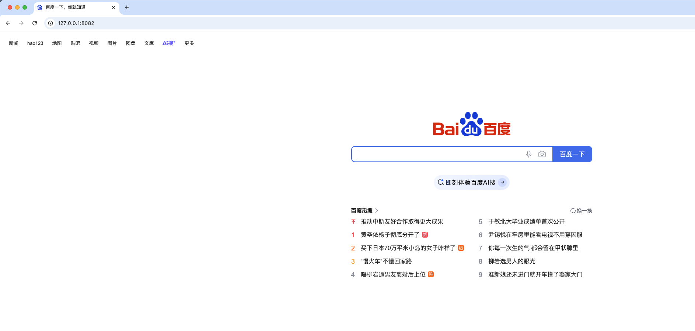

# Envoy 代理 Example

使用 envoy 代理 www.baidu.com 和 一个自建的 nginx-app 示例。

## 使用 Docker 容器启动演示示例

### 目录结构

```shell
├── README.md
├── app
│   ├── nginx-app-1                 # 模拟后台软件 -1 
│   └── nginx-app-2                 # 模拟后台软件 -2
├── docker-compose.yml              # envoy 和 模拟应用启动的 docker-compose 文件
└── envoy                       
    ├── conf                        # envoy 示例 example 配置文件目录
    │   ├── envoy-cluster.yaml      # cluster
    │   ├── envoy-dynamic.yaml      # dynamic resource
    │   ├── envoy-proxy-baidu.yaml  # 代理百度
    │   └── envoy-standalone.yaml   # standslone demo
    └── files                       # 通过文件配置 envoy 示例
        ├── cds.yaml
        ├── envoy.yaml
        └── lds.yaml
```

### 启动示例

```shell
# 进入目录执行 
$ docker compose up -d

$ docker ps
CONTAINER ID   IMAGE                           COMMAND                   CREATED         STATUS          PORTS                                             NAMES
da39d43c16c1   nginx:latest                    "/docker-entrypoint.…"   6 minutes ago   Up 6 minutes    0.0.0.0:8081->80/tcp                              nginx-app-2
e5ded377a2d2   nginx:latest                    "/docker-entrypoint.…"   6 minutes ago   Up 6 minutes    0.0.0.0:8080->80/tcp                              nginx-app-1
17a3382b5c49   envoyproxy/envoy:v1.29-latest   "/docker-entrypoint.…"   6 minutes ago   Up 6 minutes    0.0.0.0:8083->9901/tcp, 0.0.0.0:8082->10000/tcp   envoy
```

## 演示使用

### standalone 演示

在 docker-compose 文件中将挂载的 envoy.yaml 配置改为 envoy-standalone.yaml

```shell
    volumes:
      # 单个代理配置
      - ./envoy/conf/envoy-standalone.yaml:/etc/envoy/envoy.yaml
      # 代理百度
      # - ./envoy/conf/envoy-proxy-baidu.yaml:/etc/envoy/envoy.yaml
      # 代理多个应用，集群代理
      # - ./envoy/conf/envoy-cluster.yaml:/etc/envoy/envoy.yaml
      # xds 动态代理
      # - ./envoy/conf/envoy-dynamic.yaml:/etc/envoy/envoy.yaml
      # 通过文件的形式设置代理
      # - ./envoy/files/envoy.yaml:/etc/envoy/envoy.yaml
      # - ./envoy/files/cds.yaml:/etc/envoy/cds.yaml
      # - ./envoy/files/lds.yaml:/etc/envoy/lds.yaml
    networks:
```

#### envoy-standalone 配置分析

```yaml
admin:
  access_log_path: /tmp/admin_access.log
  address:
    socket_address:
      address: 0.0.0.0
      port_value: 9901

# 配置静态 API
static_resources:
  listeners:
  - name: listener_0 # 监听器的名称
    address:
      socket_address:
        address: 0.0.0.0 # 监听器的地址
        port_value: 10000 # 监听器的端口

    filter_chains: # 配置过滤器链
    - filters:
      # 过滤器配置的名称，要填写 typed_config 配置的过滤器指定的名称
      - name: envoy.filters.network.http_connection_manager
        typed_config:
          # 启用 http_connection_manager
          "@type": type.googleapis.com/envoy.extensions.filters.network.http_connection_manager.v3.HttpConnectionManager
          stat_prefix: ingress_http
          access_log:
          - name: envoy.access_loggers.stdout
            typed_config:
              "@type": type.googleapis.com/envoy.extensions.access_loggers.stream.v3.StdoutAccessLog
          http_filters: # 定义http过滤器链
          - name: envoy.filters.http.router # 调用7层的路由过滤器
            typed_config:
              "@type": type.googleapis.com/envoy.extensions.filters.http.router.v3.Router
          route_config:
            name: local_route
            virtual_hosts:
            - name: local_service
              domains: ["*"]
              routes:
              - match:
                  prefix: "/"
                route: # 路由规则，发送请求到 nginx-app 集群
                  host_rewrite_literal: nginx-app
                  cluster: nginx-app

  clusters:
  - name: nginx-app # 集群的名称
    type: LOGICAL_DNS # 用于解析集群（生成集群端点）时使用的服务发现类型，可用值有STATIC、STRICT_DNS 、LOGICAL_DNS、ORIGINAL_DST和EDS等；
    connect_timeout: 0.25s
    dns_lookup_family: V4_ONLY
    lb_policy: ROUND_ROBIN # 负载均衡算法，支持ROUND_ROBIN、LEAST_REQUEST、RING_HASH、RANDOM、MAGLEV和CLUSTER_PROVIDED；
    load_assignment:
      cluster_name: nginx-app
      endpoints: # 需要进行负载均衡的端点列表
        - lb_endpoints:
          - endpoint:
              address:
                socket_address:
                  # 这里因为是部署到 docker 容器内部去，不能写 127.0.0.1/localhost 写 宿主机的 ipv4 地址或者 docker 的 eth0 网卡或者 容器名（在同一网络下）
                  address: nginx-app-2
                  port_value: 80
```

使用 curl 访问 127.0.0.1:8082 可以看到返回 nginx 2 app 的 html 数据。

### Cluster 演示

在 docker-compose 文件中将挂载的 envoy.yaml 配置改为 envoy-cluster.yaml：

```shell
    volumes:
      # 单个代理配置
      # - ./envoy/conf/envoy-standalone.yaml:/etc/envoy/envoy.yaml
      # 代理百度
      # - ./envoy/conf/envoy-proxy-baidu.yaml:/etc/envoy/envoy.yaml
      # 代理多个应用，集群代理
      - ./envoy/conf/envoy-cluster.yaml:/etc/envoy/envoy.yaml
      # xds 动态代理
      # - ./envoy/conf/envoy-dynamic.yaml:/etc/envoy/envoy.yaml
      # 通过文件的形式设置代理
      # - ./envoy/files/envoy.yaml:/etc/envoy/envoy.yaml
      # - ./envoy/files/cds.yaml:/etc/envoy/cds.yaml
      # - ./envoy/files/lds.yaml:/etc/envoy/lds.yaml
    networks:
```

#### envoy-cluster 配置分析

和 envoy-standalone.yaml 的配置大致相同，多了一个 endpoints 端点应用。

```yaml

# 配置 envoy 的日志和 admin 控制台端口，浏览器可以通过访问 9901 端口进入到 envoy 的控制台
admin:
  access_log_path: /tmp/admin_access.log
  address:
    socket_address:
      address: 0.0.0.0
      port_value: 9901

# 配置静态 API
static_resources:
  listeners:
  - name: listener_0 # 监听器的名称
    address:
      socket_address:
        address: 0.0.0.0 # 监听器的地址
        port_value: 10000 # 监听器的端口

    filter_chains: # 配置过滤器链
    - filters:
      # 过滤器配置的名称，要填写 typed_config 配置的过滤器指定的名称
      - name: envoy.filters.network.http_connection_manager
        typed_config:
          # 启用 http_connection_manager
          "@type": type.googleapis.com/envoy.extensions.filters.network.http_connection_manager.v3.HttpConnectionManager
          stat_prefix: ingress_http
          access_log:
          - name: envoy.access_loggers.stdout
            typed_config:
              "@type": type.googleapis.com/envoy.extensions.access_loggers.stream.v3.StdoutAccessLog
          http_filters: # 定义http过滤器链
          - name: envoy.filters.http.router # 调用7层的路由过滤器
            typed_config:
              "@type": type.googleapis.com/envoy.extensions.filters.http.router.v3.Router
          route_config:
            name: local_route
            virtual_hosts:
            - name: local_service
              domains: ["*"]
              routes:
              - match:
                  prefix: "/"
                route: # 路由规则，发送请求到 nginx-app 集群
                  host_rewrite_literal: nginx-app-cluster
                  cluster: nginx-app-cluster

  clusters:
  - name: nginx-app-cluster
    connect_timeout: 0.25s
    type: STRICT_DNS
    # 负载均衡策略 ROUND_ROBIN
    lb_policy: ROUND_ROBIN
    load_assignment:
      # cluster 名字
      cluster_name: nginx-app-cluster
      # endpoints 端点 包含两个 nginx 应用
      endpoints:
        - lb_endpoints:
            - endpoint:
                address:
                  socket_address:
                    address: nginx-app-1
                    port_value: 80
        - lb_endpoints:
            - endpoint:
                address:
                  socket_address:
                    address: nginx-app-2
                    port_value: 80
```

启动容器，访问

```shell
# 注意：docker-compose 映射的宿主机地址为 8082
curl 127.0.0.1:8082

# 注意观察请求会在 nginx 1 和 2 之间使用指定的 lb 策略轮询。
```

### 代理百度演示

修改 docker-compose 中的 envoy 配置为 envoy-proxy-baidu.yaml

```shell
    volumes:
      # 单个代理配置
      # - ./envoy/conf/envoy-standalone.yaml:/etc/envoy/envoy.yaml
      # 代理百度
      - ./envoy/conf/envoy-proxy-baidu.yaml:/etc/envoy/envoy.yaml
      # 代理多个应用，集群代理
      # - ./envoy/conf/envoy-cluster.yaml:/etc/envoy/envoy.yaml
      # xds 动态代理
      # - ./envoy/conf/envoy-dynamic.yaml:/etc/envoy/envoy.yaml
      # 通过文件的形式设置代理
      # - ./envoy/files/envoy.yaml:/etc/envoy/envoy.yaml
      # - ./envoy/files/cds.yaml:/etc/envoy/cds.yaml
      # - ./envoy/files/lds.yaml:/etc/envoy/lds.yaml
```

#### envoy-proxy-baidu 配置分析

```yaml
admin:
  access_log_path: /tmp/admin_access.log
  address:
    socket_address:
      address: 0.0.0.0
      port_value: 9901

# 配置静态 API
static_resources:
  listeners:
  - name: listener_0 # 监听器的名称
    address:
      socket_address:
        address: 0.0.0.0 # 监听器的地址
        port_value: 10000 # 监听器的端口

    filter_chains: # 配置过滤器链
    - filters:
      # 过滤器配置的名称，要填写 typed_config 配置的过滤器指定的名称
      - name: envoy.filters.network.http_connection_manager
        typed_config:
          # 启用 http_connection_manager
          "@type": type.googleapis.com/envoy.extensions.filters.network.http_connection_manager.v3.HttpConnectionManager
          stat_prefix: ingress_http
          access_log:
          - name: envoy.access_loggers.stdout
            typed_config:
              "@type": type.googleapis.com/envoy.extensions.access_loggers.stream.v3.StdoutAccessLog
          http_filters: # 定义http过滤器链
          - name: envoy.filters.http.router # 调用7层的路由过滤器
            typed_config:
              "@type": type.googleapis.com/envoy.extensions.filters.http.router.v3.Router
          route_config:
            name: local_route
            virtual_hosts:
            - name: local_service
              domains: ["*"]
              routes:
              - match:
                  prefix: "/"
                route: # 路由规则，发送请求到 nginx-app 集群
                  host_rewrite_literal: www.baidu.com
                  cluster: nginx-app

  clusters:
  - name: nginx-app # 集群的名称
    type: LOGICAL_DNS # 用于解析集群（生成集群端点）时使用的服务发现类型，可用值有STATIC、STRICT_DNS 、LOGICAL_DNS、ORIGINAL_DST和EDS等；
    connect_timeout: 0.25s
    dns_lookup_family: V4_ONLY
    lb_policy: ROUND_ROBIN # 负载均衡算法，支持ROUND_ROBIN、LEAST_REQUEST、RING_HASH、RANDOM、MAGLEV和CLUSTER_PROVIDED；
    load_assignment:
      cluster_name: nginx-app
      endpoints: # 需要进行负载均衡的端点列表
      - lb_endpoints:
        - endpoint:
            address:
              socket_address:
                address: www.baidu.com
                port_value: 443
    transport_socket: # 用于与上游集群通信的传输层配置
      name: envoy.transport_sockets.tls # tls 传输层
      typed_config:
        "@type": type.googleapis.com/envoy.extensions.transport_sockets.tls.v3.UpstreamTlsContext
        sni: www.baidu.com
```

之后重启 docker compose 容器：

```shell
docker compose down

docker compose up -d
```

之后浏览器访问 8082 端口，可以看到如下效果：



### Dynamic 演示

将在 xds/golang-xds-impl 中说明。
