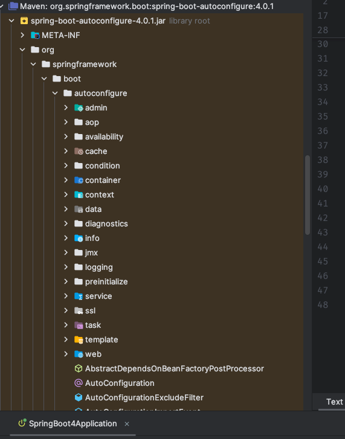
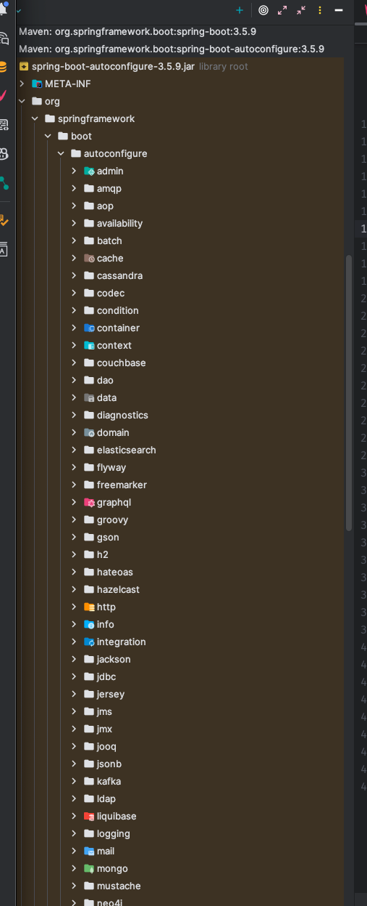

# Spring Boot 3 升级 Spring Boot 4

官方升级指南：https://github.com/spring-projects/spring-boot/wiki/Spring-Boot-4.0-Migration-Guide#starters

> Spring 官方推荐先升级到 Spring Boot 3.5.x 之后在升级到 Spring Boot 4

## 变更项

### 模块化分离

spring-boot-autoconfigure 拆分为多个模块。

4.0.1



3.5.9



包结构变化：

```java
// Spring Boot 3.x
import org.springframework.boot.autoconfigure.web.servlet.WebMvcAutoConfiguration;

// Spring Boot 4.0
import org.springframework.boot.webmvc.autoconfigure.WebMvcAutoConfiguration;
```

### 测试依赖升级

- spring-boot-starter-webmvc -> spring-boot-starter-webmvc-test
- spring-boot-starter-webflux -> spring-boot-starter-webflux-test
- ...


### starter 命名变化

- spring-boot-starter-web -> spring-boot-starter-webmvc
- spring-boot-starter-aop -> spring-boot-starter-aspectj
- ...

## 测试升级

> https://github.com/deigmata-paideias/deigmata-paideias/spring-boot-3-4

JDK：17
Spring Boot Version：3.5.0

JDK：25
Spring Boot Version: 4.0.1

使用到的依赖：

```xml
<dependencies>
    <dependency>
        <groupId>org.springframework.boot</groupId>
        <artifactId>spring-boot-starter-web</artifactId>
    </dependency>

    <dependency>
        <groupId>org.springframework.boot</groupId>
        <artifactId>spring-boot-starter-data-jpa</artifactId>
    </dependency>

    <dependency>
        <groupId>com.mysql</groupId>
        <artifactId>mysql-connector-j</artifactId>
        <scope>runtime</scope>
    </dependency>
</dependencies>
```

只使用以上依赖，在 spring boot 升级到 4.x 之后并没有不兼容项。

:::Tips
spring-boot-starter-web 在 4.x 中被标记废弃，新的包变为 spring-boot-starter-webmvc，旧包将在之后移除
:::

## Spring AI 的不兼容升级

### 框架

Sping AI 的不兼容升级点：

手动线程池配置 -> 虚拟线程池配置

Jackson 序列化配置（最复杂的），Jackson2ObjectMapperBuilderCustomizer 弃用，推荐用 JsonMapperBuilderCustomizer；
https://github.com/spring-projects/spring-boot/wiki/Spring-Boot-4.0-Migration-Guide#upgrading-jackson

Spring Retry 依赖管理变化，需要明确指定版本，在 DashScopeXXModel 里有用到。
https://github.com/spring-projects/spring-boot/wiki/Spring-Boot-4.0-Migration-Guide#dependency-management-for-spring-retry

@Nullable 注解包变化；
https://github.com/spring-projects/spring-boot/wiki/Spring-Boot-4.0-Migration-Guide#removed-support-for-javaxannotationsnonnull-and-orgspringframeworklangnullable

MongoDB ES Redis 各个配置项都有变化。
https://github.com/spring-projects/spring-boot/wiki/Spring-Boot-4.0-Migration-Guide#upgrading-data-features

测试升级
https://github.com/spring-projects/spring-boot/wiki/Spring-Boot-4.0-Migration-Guide#upgrading-testing-features

### 生态层面

`Spring Boot 4.0 requires Java 17 or later. Using the latest LTS release of Java is encouraged.`

Spring Boot 4.x 仍然支持 JDK 17+，对于 grallvm 用户，建议用 JDK 25.

`Spring Boot 4 is based on Jakarta EE 11 and requires a Servlet 6.1 baseline. pring Framework 7.x`

`Undertow` 不兼容 servlet 6.1，spring boot 4.x 移除掉了。

可能存在部分组件仍然没适配 Spring Boot 4 的情况。升级上去没有可用版本。

### 用户层面

在 graph 如果使用自定义的序列化类，需要升级；
