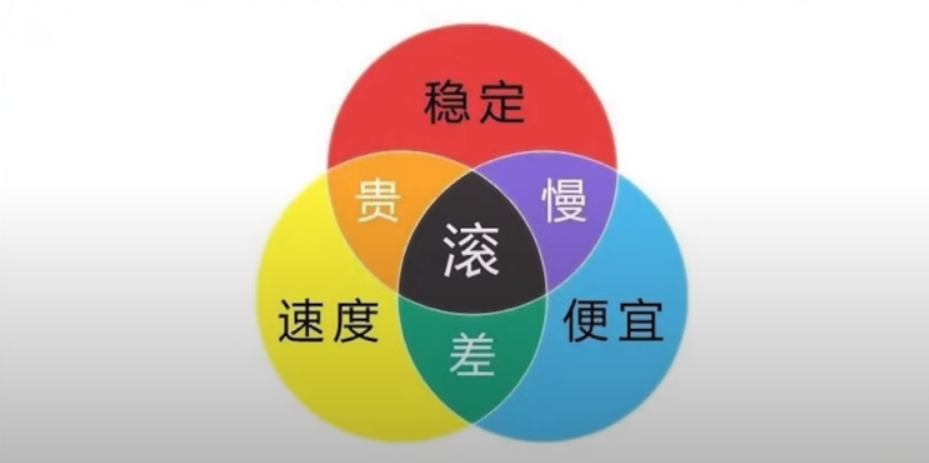

# 科学上网

## 1.墙

### 墙到底是什么？

墙是 ：防火长城，GFW 英文全称是 `Great Fire Wall`

>  在08年以前，我国的网络体系还不健全，所以现在不能访问的一些网站在当时都是可以访问的。后来因为一些政治原因，建立起了网络审查制度，部署了防火长城，阻挡大陆互联网用户访问境外的一些网站和服务。
>
> **注意：审查制度不等同于GFW**
>
> 审查制度针对的是所有的互联网的流量，国内的网站会受到政府的直接干预，要求自我审查，自我监管甚至关闭，大陆所有网站都是强制执行的。
>
> 而GFW是为了过滤境外的访问。在建立初期的时候，一度被认为是为了和世界隔离，洗脑和愚化民众。真正的导火索是**08年奥运会前夕恐怖组织在FackBook上策划并且实施了对我国西部地区的一次恐怖袭击，中国政府为了审查和预防类似事件发生，向FaceBook提出审查要求，被FaceBook以尊重和保护用户隐私为由拒绝，Google也以同样理由拒绝。于是中国政府就将FaceBook和Google的服务，搜索引擎，Gmail等服务陆续封锁，还有Twitter和Tumblr等比较大型的互联网服务商。**墙因政治事件而起却连累到了各种色情网站等。

### 利弊分析

权衡利弊，辩证、理性分析！

## 2.GFW原理和Shadowsocks/ShadowsockR/Varay/Trojan是如何突破封锁的？

### 没有GFW时的网络通讯过程

```shell
PC机
|
packet     数据包
|
本地网络    交换机，路由器 -> 
|
骨干网		
|
DNS		   DNS（Domain Name Service 域名解析）将网址解析成服务器地址，请求真正的服务器
|
国际出口
|
对应服务器
|
此服务器给PC机返回一个数据包
```

### 有了GFW的访问过程

```shell
PC机
|
packet     数据包
|
本地网络    交换机，路由器 -> 
|
骨干网		
|
DNS		   DNS（Domain Name Service 域名解析）将网址解析成服务器地址，请求真正的服务器
|
GFW		   数据包发送的是http，是一种明文流量，GFW可以探测到你访问的服务地址，给你解析出一个错误的地址，就不能访问google了
|
国际出口
|
对应服务器
|
此服务器给PC机返回一个数据包
```

```shell
GFW封锁互联网的方式：
	DNS污染: 解析错误地址或者不解析
	过滤关键字，包含一些敏感词的时候会被终断连接
	端口阻断：对一些特定IP服务器的主机的一些特定的端口进行阻断。比如443和22等端口
	Ip地址批量封锁：对运行一段时间的拦截地址进行分析，封锁大批的ip地址
```

### 主流的翻墙方式的工作原理

> 经过对GFW的原理进行分析，我们知道：**只要GFW探测不到数据包的数据内容，找到一个GFW认为合理的服务器中转我们的请求，由此服务器去完成我们想要做的事情，整个过程进行加密。**我们发现这套逻辑很符合现实情况，这也是早期一些VPN，ssh代理翻墙的方式。

```shell
SSH翻墙为例：

PC
|
packet  对发出的数据包进行加密，经过本地网发送
|
骨干网
|
DNS     DNS解析出一个合理，GFW允许访问的服务器地址，GFW放行
|
GFW		
|
SSH Server	经过中转服务器解密，解密出真实访问的服务器地址。请求到服务主机
|
Google、Twitter服务器
|
响应数据到中转服务器再到PC机
```

经过一段时间的运行，GFW发现越来越多的数据包是这种形式，所以GFW根据这些特征明显的数据流量做出了两件事

1. 屏蔽VPN端口
2. 慢慢积累这些提供VPN服务的ip，GFW进行封禁

### Shadowsocks的出现

shaowsocks引出了把中转服务器分为本地和远程的两个概念，实现经过GFW的流量全部加密，后续出现的SSR，Vray全部是这些原理

```shell
流程分析：

PC
|
ss local    本地的Shadowscoks服务器（可以是软件，也可以是路由，软路由等硬件设备）  加密request，解密response
|
GFW
|
ss server  解密request
|
Google/Twitter
|
ss server 加密response
|
GFW
|
ss local 解密response
|
pc机
```

因为shadowsocks全称加密，所以GFW无法嗅探到这些敏感词

ssr和V2ray都是基于这个原理，有些细微差别

> GFW不封锁所有的国际加密流量的原因是：相比翻墙产生的流量，其余99%都是正常的通信流量。如果全部屏蔽，国内网就是局域网

相比于VPN，因为shadowsocks已经在本地发送的时候完成了数据加密，所以GFW无法探测到固定的模式和特征

## 各种翻墙方式的优点和缺点

### VPN翻墙方式的优缺点

> VPN的全称是：Virtual Private Network，早期因为这种翻墙方式非常流行，所以人们认为翻墙就是VPN。这种叫法是错误的
>
> 虚拟专用网络(VPN)的功能是：在[公用网络](https://baike.baidu.com/item/公用网络/12752077?fromModule=lemma_inlink)上建立[专用网络](https://baike.baidu.com/item/专用网络/795899?fromModule=lemma_inlink)，进行[加密](https://baike.baidu.com/item/加密/752748?fromModule=lemma_inlink)通讯。在[企业网络](https://baike.baidu.com/item/企业网络/2119389?fromModule=lemma_inlink)中有广泛应用。
>
> [VPN](https://baike.baidu.com/item/VPN?fromModule=lemma_inlink)网关通过对[数据包](https://baike.baidu.com/item/数据包/489739?fromModule=lemma_inlink)的加密和数据包目标地址的转换实现[远程访问](https://baike.baidu.com/item/远程访问/3326708?fromModule=lemma_inlink)。VPN可通过[服务器](https://baike.baidu.com/item/服务器/100571?fromModule=lemma_inlink)、硬件、软件等多种方式实现。
>
> VPN早先是在公司内被使用，出于公司内部信息安全考虑，和客户的通信内容需要被加密，所以架设了VPN。
>
> **因为VPN这种对数据包加密方式的特点，使得可以绕过GFW**

#### 优点

- 端对端加密，通信内容不会被中间劫持，从而被泄密。

#### 缺点

- 不稳定：因为是在本地进行加密，所以数据包的特征值明显，经过一段时间的使用，GFW就会探测出这些ip地址，从而封禁ip，
- 通过套餐的形式出售给私人用户，经过一段时间使用之后，ip被GFW记录，钱就打水漂了。
- 不安全，随时会被封。

### shadowsocks产品及其衍生品

相对VPN更加安全，在本地做好加密之后，在发送给服务器。GFW探测不到数据包内容

### 

### 软件翻墙方式的明显缺点

> 绝大多数的软件没有那么高的底层权限，只能代理到应用层的所有流量。

### 全局代理的概念

> 全局代理指的是代理代理翻墙软件所能接管到的所有流量，不是代理计算机的所有流量。
>
> 所以计算机上的一些软件在开了全局代理之后还不能翻墙，是因为他们的数据包在系统层，甚至不遵循操作系统的代理规则，不把通信流量给翻墙软件接管，所以不能实现翻墙。代表性应用有一系列的UWP应用，比如 windows应用程序下载的软件，游戏流量等。
>
> **很多游戏遵循的是TCP、UDP协议，通信数据不被翻墙软件街接管。所以游戏没办法加速**

### 硬件翻墙


上面提到的全局代理的概念，一些翻墙软件可以通过在硬件层模拟出虚拟网卡，来达到接管流量的目的。

UWP应用不能翻墙的解决方法之一就是硬件翻墙，路由器是接入网络的最后一个环节。独立于计算机之外，可以无视计算机操作系统的代理规则。达到真正的全局代理

> 可以理解为将翻墙软件安装在了路由器上！

#### 路由器翻墙的特点

- 实现真正的全局代理
- 为无法安装翻墙软件的设备提供传说中的透明代理，比如AppleTV，机顶盒等设备。翻墙之后可以流媒体内容。
- 理论上连接到路由器的设备都可以实现翻墙
- 缺点也很明显，路由器的算力有限，只能满足最基本的路由功能。进行大量的加解密计算的时候，性能会下降，网络速度下降等

#### 软路由翻墙

> 软路由设备是市面上的路由经过改造之后的路由，可以理解为一台小型的计算机，性能优异

##### 特点

- 能代理所有流量
- 不用担心性能瓶颈
- 比较贵
- 配置繁琐
- 稳定性
- 维护繁琐

### 网关模式翻墙

> 可以理解为不需要在局域网中安装一个专属的路由器或者是软路由等硬件。而是通一台计算机上跑的软件模拟出来一个路由器的功能，接管局域网中的所有设备流量同时翻墙

#### 优点

- 网络架构简单
- 性能更好
- 便于集中管理，设置好DNS和子网掩码，即可实现透明代理

## 线路问题

### CN2 QoS

CN2全称是：Chinatelecom Next Carrier Network的缩写（CNCN），中国电信下一代承载网络，相比现在用163骨干网。搭载了QoS技术，面向政企大客户，保证高质量的网络通信

QoS的全称是： Quality of Service的缩写，服务质量。能够动态的根据服务内容来调节网络带宽的优先级。163骨干网不分优先级，用的人多，就会出现掉包，网络拥堵，卡的问题。

### CN2GT CN2GIA

CN2网络包含两种线路分别是：CN2GT（Global Transit）和CN2GIA（Global Internet Access）。CN2GT便宜，质量一般，但相比于163骨干网好。GN2GIA更贵，但是质量好。

**注意：买线路的时候需要注意买的是单向CN2还是双向CN2**

### BGP 

BGP全程是：Border Gateway Protocol，边界网关协议，会识别你的流量是移动，电信还是联通。自己选择最适合你的线路，如果线路故障，还会自己选择线路来连接到服务器

### 三大巨头线路 GCP AWS Azure

GCP全称是：Google Cloud Platform

AWS全称是：Amazon Web Service

微软的Azure

> 不针对国内市场，三个都不建议考虑。

### PCCW IPLC

PCCW是香港电讯盈科提供的线路，到大陆走的是自己接的直连。

**游戏加速器线路：IPLC线路是最好的，其次是CN2和CN2GIA**

## 机场和VPS的选择

### VPS用户

第一类人

- 写代码
- 搞网络，经常要调试程序
- 自己建站

第二类人

- 爱折腾的发烧友

第三类人

- 卖给别人的，vps

### 机场用户

- 直接搜索
- 朋友推荐

### 机场的正确选择

- 优先选择大机场

- 大机场优先选择免费使用的先体验，测试时间最好在周末晚上。

- 流媒体的限制，ip的封禁

- 参考图

  

  **推荐优先使用大机场，小机场一般出了问题没那么多经验维护，不靠谱。容易跑路等**

## 协议之战

shadowsocks、v2ray和Trojan

> 目前来说，GFW的探测方式有好多种，特定时期的人工干预，被动数据包探测和主动嗅探等手段，非常多。
>
> 不存在绝对安全的协议，只有相对安全的协议。GFW可能已经知晓你的意图，在你不涉及一些敏感的政治话题的时候，是不会封禁你的ip的。

### shadowsocks协议

原理看之前的第二章

在目前来说，仍然是体验最好，最简单，最快速，极度体现暴力美学的中转代理方式。

没有任何人可以准确的告诉你，shadowsocks已经被精确识别、判断并且封锁了。这种风险存在，原因是多维度的，要理性分析。

但是仍然是目前最主流的翻墙协议。

### shadowsocksR

是shadowsocks的升级版，对于其安全性，是具有很大争议的。

### V2Ray

是通过不断优化升级的方式来解决潜在的可能出现的安全性问题。

安全性更多，但是部署和推广比较麻烦。

从通讯延迟的角度来说，因为机制的问题，导致握手次数比shadowsocks更多。

从加密算法来说，v2ray采用的原创Vmess协议和TLS两次加密的方式，对CPU的算力要求更高，不适合部署在服务器和老旧的手机上。

v2ray支持的协议数量多。

### Trojan协议

Trojan的出现解决的是v2ray的一下缺点问题，核心原理还是借鉴的websocket+tls方式。

- 解决了复杂和部署难度大的问题，只有一种websockets+tls的方式
- 在加密协议方面，只使用了tls，没有使用Vmess的加密方式。

## 主流翻墙代理的优缺点

### VPN

**VPN的初衷是用来做用户隐匿，加密通讯保护数据安全性，起初不是为了做翻墙用的。VPN对数据流量特征没有任何应对行可言。**

缺点很明显，就是被GFW探测到并且已经封锁了。但是目前国内这种用户仍然是数量最多的一部分。

优点也很明显，VPN在OSI模型非常底层，能达到真正意义上的全局代理，接管所有的系统流量。可以理解成VPN建立了一个相当于虚拟网卡的方式。甚至在第三方的眼中，你的ip地址就是VPN服务器的ip。

> 其他方式都是Socks5代理的方式，在网络层级中是在应用层的会话层，不能接管全部流量。比如游戏流量和UWP应用的流量。这就是为什么使用shadowsocks开了全局还不能打游戏，和不能使用ping和trace等ICMP指令的原因。

正常情况下：

- 谷歌浏览器，邮件服务器，文件传输等在应用层，
- v2ray，trojan，shadowsocks这些跑在会话层
- 游戏数据直接通过TCP和UDP进行通讯，跑在传输层。
- icmp指令在网络层
- vpn的各种协议都在数据链路层和网络层。这也是vpn的一大优点，可以接管几乎所有的操作系统流量


> 但是目前GFW已经完美探测到了VPN的数据包流量特征并实施了封锁。现在目前能用的VPN都是海外的VPN，通过不断的更换IP的方式来对抗GFW。
>
> 这样VPN的稳定性极差，价格贵等。

### Socks5代理的翻墙方式

从性能和安全角度来说，翻墙的主要方式还是采用了socks5的shadowsocks和shasowsocksr，v2ray和Trojan。

### WireGuard

新出来的一个VPN，主要是加强安全性。对抗美国的棱镜计划。相比VPN工具有点特殊，VPN主要从采用TCP协议，而WrieGuard基于UDP协议。但是不推荐使用其翻墙！

